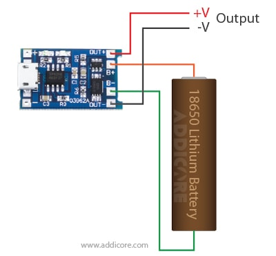
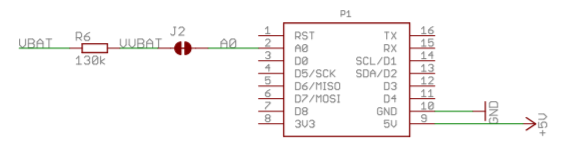

# Charger Notes

The wemos d1 is based on the ESP8266 and requires a voltage range of 2.6-3.6V.  The VIN pin can accept 4-6V.  Powering the wemos directly from a lipo cell is not recommended.  The fully charged voltage is over 4 volts.

If you look at the Wemos Battery Shield schematics, you will see that the charger IC has two functions: Charging the battery, and stepping up the voltage to 5V for the wemos. If you don't mind waiting, the battery shield is cheap to purchase from aliexpress. 

https://www.wemos.cc/en/latest/d1_mini_shield/battery.html

This article is for those who want to use their own battery charger.  You just need a charger, a step up regulator, Over-Discharge Protection, and a resistor divider.

--------------------

# Charger

I found TC4056A based USB C chargers for cheap on amazon. https://amzn.to/3uVuUw5

Documentation: https://www.addicore.com/TP4056-Charger-and-Protection-Module-p/ad310.htm

# Step up Regulator

TBD

https://amzn.to/34X2uac - 5V step Up Circuit

# Over-Discharge Protection

The OUT+/- pins on the TC4056A charging module will give you Over-Discharge Protection.

# Resistor Divider

To read the battery voltage on A0, you will need to divide it down to a voltage safe for the wemos to read.  My code expects a 130Kohm resistor in series with the battery to A0.  Refer to the link for calculating other resistances.

https://arduinodiy.wordpress.com/2016/12/25/monitoring-lipo-battery-voltage-with-wemos-d1-minibattery-shield-and-thingspeak/

	
# Wiring

TBD
