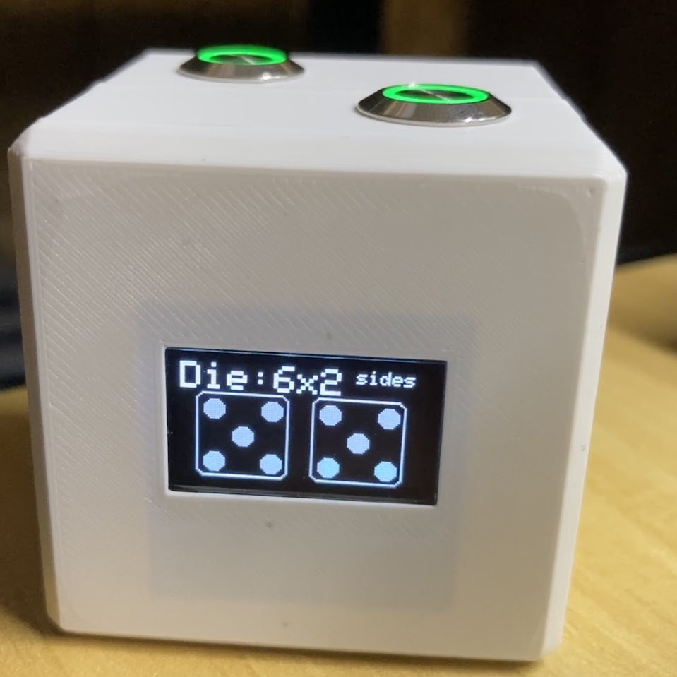

# OLED-Digital-Dice

This project is based on the work of Joe Coburn for the original design and Fernando Hernandez (Dsk001) for the Wemos version.

This Electronic Die has the capability to swap between a coin and die with 4, 6, 8, 10, 12, and 20 sides and also a double 6 sided. Useful for table top gaming, or dice games that require two 6 sided die.

This version adds:
* Button debouncing
* Fixed randomizer
* Battery monitoring
* Shake sensor for dice rolls
* Auto Power Off (Deep Sleep)
* Neopixels

Two tilt sensors are used to detect a shake movement.  This helps provide a more chaotic response. 

Sources:
* 2017 Joe Coburn https://www.makeuseof.com/tag/roll-style-diy-electronic-d20/
* 2018 Tomas Carlsson (TomasC62) https://www.instructables.com/Arduino-Oled-Dice/
* 2021 Fernando Hernandez (Dsk001) https://www.prusaprinters.org/prints/66933-electronic-dice

# Hardware Used:

* 1 x D1 Mini (ESP8266, WiFi capable) https://amzn.to/3fCb4l7
* 1 x 0.96" I2C IIC SPI Serial 128x64 OLED screen https://amzn.to/3fxuOpV
* 2 x 12mm Push Buttons (LED optional) https://amzn.to/3p69FGo
* 2 x Metal Ball Tilt Switches (optional) https://amzn.to/34mlJKk

For battery operation (optional):

* 1 x Wemos D1 Battery Shield https://amzn.to/3c98Rvk
* 1 x 500mAh Lipo 
* 1 x 12mm LED Latching Push Button https://amzn.to/3uBmppL

We are a participant in the Amazon Services LLC Associates Program, an affiliate advertising program designed to provide a means for us to earn fees by linking to Amazon.com and affiliated sites.

# Printing:

Some openscad files are included in the project.  They assume you have downloaded the source files from https://www.prusaprinters.org/prints/66933-electronic-dice

* oled_face_mod.stl - The front shell oled area is trimmed to make it easier to fit.
* battery_back_mod.stl - The back shell includes cutaways for the battery shield, second usb connector, and a on/off push button.

# Pin References:

|Signal|In Type / Output Type|Label|GPIO|Input|Output|Notes|
|-------------|-------------|-------------|-------------|-------------|-------------|-------------|
|Deep Sleep Exit|Wire to RST|D0|GPIO16|no interrupt|no PWM or I2C support|HIGH at boot, used to wake up from deep sleep|
|Display SCL|I2C|D1|GPIO5|OK|OK|often used as (I2C)|
|Display SDA|I2C|D2|GPIO4|OK|OK|often used as (I2C)|
|Roll Button|Active Low Input|D3|GPIO0|pulled up|OK|connected to FLASH button, boot fails if pulled LOW|
|Die Button|Active High Input|D4|GPIO2|pulled up|OK|HIGH at boot, connected to on-board LED, boot fails if pulled LOW|
|Tilt Sensor 1|Active High Interrupt|D5|GPIO14|OK|OK|SPI (SCLK)|
|Roll LED|Active High Output|D6|GPIO12|OK|OK|SPI (MISO)|
|Neopixel Data|Data Output|D7|GPIO13|OK|OK|SPI (MOSI)|
|Dice LED|Active High Output|D8|GPIO15|pulled to GND|OK|SPI (CS), Boot fails if pulled HIGH|
|Tilt Sensor 2|Active High Interrupt|RX|GPIO3|OK|RX pin|HIGH at boot|
|||TX|GPIO1|TX pin|OK|HIGH at boot, debug output at boot, boot fails if pulled LOW|
|Battery Monitor|Analog Input|A0|ADC0|Analog Input|X||

Source: https://randomnerdtutorials.com/esp8266-pinout-reference-gpios/

# Assembly:

Wire up the following:

 *  D2(SDA), D1(SCL) to OLED
 *  D0 to RST
 *  D3 to Button (ROLL) to Ground
 *  D4 to Button (DIE) to 3.3V
 *  D5 to Tilt Sensor to Ground
 *  RX to Tilt Sensor to Ground
 *  D6 to Button (ROLL) LED to Ground
 *  D8 to Button (DIE) LED to Ground
 *  D7 to Neo Pixel Data (optional)
 *  A0 to Battery through Resistor Divider (optional)

If using the Battery Shield and you have v1.2.0 or higher, you can solder jumper J2 to connect the battery to A0 through a 130k resistor.
If not using a battery, comment out #define USE_BATTERY in code.

Test the circuit, then stuff into the 3D printed case.  Use hot glue or similar to affix the OLED.

Glue the tilt switch with the wires facing up, so the dice is only rolled when you shake it on it's side or upside down.
This prevents the number from changing while the dice is just sitting on the table.

# Programming:

You will need to add the d1 mini (esp8266) and LCD (SSD1306) to your Arduino IDE. Instructions here: https://github.com/esp8266/Arduino#installing-with-boards-manager

Select "NodeMCU 1.0 (ESP-12E Module)" from Tools > Board.

Program the board.

If you need more help: https://learn.adafruit.com/adafruit-huzzah-esp8266-breakout/using-arduino-ide

# Usage: 
 
*  Press ROLL button to roll dice.
*  Shake tilt sensors to roll dice.
*  Hold ROLL button to disable tilt sensors.
*  Press DICE button to change dice.
*  Hold DICE button to check battery info.

If USE_BATTERY was defined in code, after 15 minutes without a button press the dice will turn off the display and enter deep sleep.  Toggle the RST pin or turn off and on to wake up.
